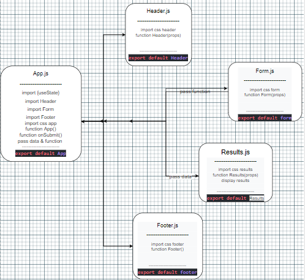

# RESTy

A browser based API testing tool

## Business Requirements

> Our application will be an API testing tool that can be run in any browser, allowing a user to easily interact with APIs in a familiar interface.

## UML

---

## phase_1

| name | link                                                     |
| ---- | -------------------------------------------------------- |
| PR   | [ PR](https://github.com/Mujahedyousef/RESTy-API/pull/3) |

---

### phase_2

- Extend your React Application so that your functional components are able to manage their own state variables using the useState Hook.
  NOTE: It is not a requirement to make the actual API call. That can be mocked with “fake” data

1. Refactor any components using this.setState to implement the useState react API hook.
1. Refactor the Form Component to implement user input from form elements, instead of hard coded string values.

| name    | link                                                     |
| ------- | -------------------------------------------------------- |
| Api     | [json](https://jsonplaceholder.typicode.com/posts)       |
| netlify | [website](https://resty-mujahed-asac.netlify.app/)       |
| PR      | [PR](https://github.com/Mujahedyousef/RESTy-API/pull/11) |

---

### phase_3

- in this phase, I used hook useEffect( ) after getting data sometimes, for removing their data on page.
- Give different styles for each method.
- clear data after 1.5min.

| name    | Links                                                    |
| ------- | -------------------------------------------------------- |
| Website |                                                      |
| PR      | [PR](https://github.com/Mujahedyousef/RESTy-API/pull/12) |
